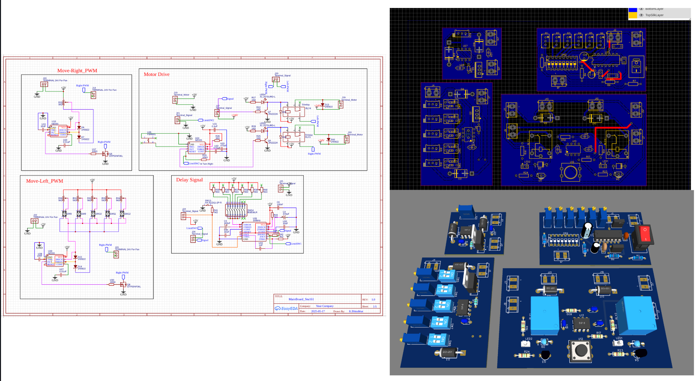
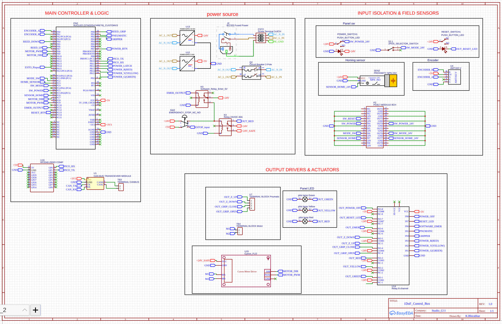
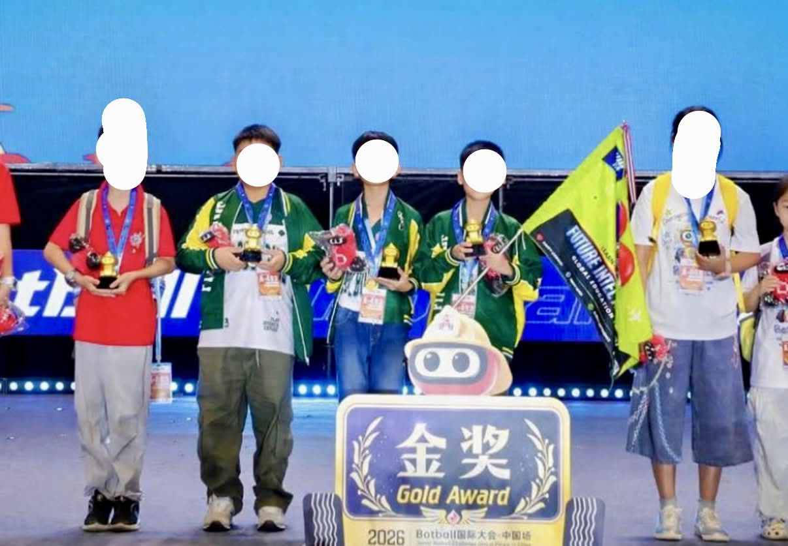
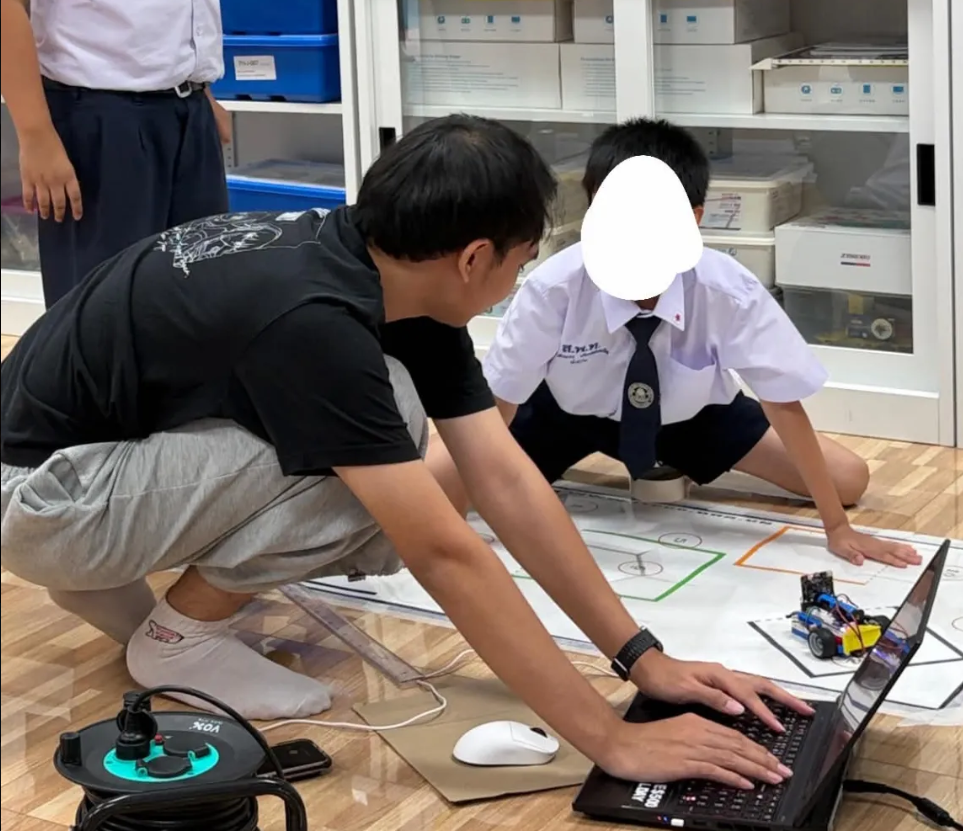

<a href="#about">About</a> &nbsp; | &nbsp; <a href="#experience">Experience</a> &nbsp; | &nbsp; <a href="#additional-work">Additional Work</a> &nbsp; | &nbsp; <a href="#projects">Projects</a> &nbsp; | &nbsp; <a href="#competitions">Competitions &amp; Mentoring</a> &nbsp; | &nbsp; <a href="#tools">Tools</a> &nbsp; | &nbsp; <a href="#contact">Contact</a>

 

<h1 align="center">Bhirabhat Klomjit (Pae)</h1>
<h3 align="center">Robotics & Automation Engineering Student</h3>

Robotics Integration · Industrial Systems · Embedded Control

FIBO, KMUTT · 3rd Year

  
  

---

### About

Robotics & Automation Engineering student at **FIBO, KMUTT** with hands-on experience integrating robotics, industrial systems, software, and embedded hardware. I work across subsystem boundaries by translating requirements, coordinating interfaces, deploying integrated systems, and validating them through testing and troubleshooting.

| | |
|---|---|
| **Degree** | B.Eng. Robotics & Automation · FIBO, KMUTT |
| **Year** | 3rd Year |
| **Focus** | Robotics System Integration · Industrial Automation · Embedded Control |

---

### Selected Engineering Experience

#### FIBO — Pile Monitoring & Industrial Station Integration

*Apr 2026 — Present · R&D prototype for an industrial wood-handling site*

A LiDAR-based system for tracking wood piles so a wheel loader can handle them with less manual work. Processed LiDAR data and the decision algorithm come from other teams; I worked on the station-side layer that connects them to the robot and the operators.

- Designed the database and state logic (PostgreSQL) that turn processed LiDAR output into pile and storage-slot state.
- Defined and documented a read-only interface for the decision-algorithm team to read that state, and wrote an example client.
- Integrated the robot's status feed over MQTT as a read-only safety boundary.
- Developed a read-only validation dashboard (FastAPI, React) for checking pile, slot and robot data on a map, and deployed the stack on the station's Windows system with a health check and a verified deployment script.
- Originated and deployed a Station Monitor for station, LiDAR, network and robot health, using Aruba controller data and field tests for network diagnostics, and supported the vendor's final tuning and on-site validation.

Deployed on the station and used in on-site tests with the real robot; still an R&D prototype.

  

  
  

Left: operations screen. Right: cross-checking the robot pose on our validation screen against the robot's own 3D viewer during field testing.

#### FACOBOT AMR — Operator Interface & ROS 2 Integration

*Dec 2025 — May 2026*

- Developed the robot-interface web application for a warehouse AMR, covering manual control, mission execution, robot status, error and status handling, and operator workflows.
- Built the ROS 2 action bridge that connects the web application to ROS 2, because the required action workflow could not be handled properly through the normal direct WebSocket approach, and integrated ROS 2 actions, topics, services, action feedback/results, and robot state.
- Implemented safety behavior including dead-man control, a connection watchdog, stopping commands on disconnect, state-based command gating, and emergency-stop handling.
- Tested and debugged on the real robot, including UI/state mismatch, action-feedback issues, repeated commands, disconnections, and safety edge cases.

Core navigation, QR, Pure Pursuit, and docking algorithms were primarily developed by other team members; I helped test, debug, and integrate those features.

  
  

#### Carver — ROS 2 Migration & SLAM / Localization

*Jun 2026 — Jul 2026*

- Developed and integrated the SLAM/localization subsystem using SLAM Toolbox, including ROS 2 launch/configuration, topic remapping, LiDAR/TF integration, and map generation.
- Tested and debugged the subsystem in Gazebo/RViz, addressing TF, mapping, localization, and LiDAR integration issues; real-robot tuning remains for the hardware-integration stage.

---

### Additional Technical Work

#### Peplink — GPS–Odometry Alignment

*Jan 2026 — Mar 2026*

Owned the GPS-to-robot-odometry alignment task and tested it with real hardware and data to align outdoor positioning with the robot's local odometry frame.

- Worked on coordinate conversion, frame alignment, covariance handling, and integration of the alignment logic.

---

### Coursework & Robotics Projects

#### LiftEase — Patient Transfer Bed

*Year 1 · Semester 1*

- Designed the prototype concept and mechanical structure in SolidWorks, including the conveyor-based transfer mechanism and motor integration.
- Selected and integrated the motors, electrical controls, and basic firmware, and worked with teammates on mechanical assembly and prototype testing.
- Built as an early functional prototype to demonstrate the transfer concept; usability and safety were not yet developed to a practical product level.

  
  

#### Squash Ball Hitting Machine

*Year 1 · Semester 2*

- Designed the machine's control electronics in EasyEDA, including 555-timer timing/PWM circuits, relay/MOSFET motor-control stages, PCB layouts, and a custom power-supply section.
- Selected components, calculated the power-supply design, assembled and wired the electronics, then tuned and tested the complete system on the physical machine.

  
  
  

#### Drum Oil Skimmer for CNC Machine Coolant Tank

*Year 2 · Semester 1*

- Developed the Raspberry Pi Pico-based control system, including circuit/PCB work, wiring, power, pH sensing, LCD interface, motor control, and firmware.
- Integrated and tested the complete prototype under real operating conditions, including investigation of pH measurement noise observed while the motor was running.

  
  

#### 1-DOF Pick-and-Place Arm

*Year 2 · Semester 2*

- Designed the complete electrical/control system around an STM32G474RE, from component selection and EasyEDA schematics to control-box layout, wiring, assembly, and hardware testing.
- Integrated 24 V field sensors, encoder feedback, opto-isolated inputs, relay/pneumatic outputs, motor drive, emergency-stop circuitry, and panel controls.
- Developed firmware for sensor handling, homing, safety/emergency behavior, and system state/command handling; debugged the complete system on hardware.
- My contribution focused on electrical/control and integration; the mechanical arm structure was developed by other team members.

  
  
  

---

### Competitions & Mentoring

#### ABU Robocon — Meihua

- Handled the main mobile-base software integration using ROS 2 and micro-ROS, connecting high-level commands, low-level control, robot feedback, and interfaces contributed by multiple team members.
- Tested and tuned the real robot in workshop and field conditions, focusing on straight-line motion, yaw response, motor behavior, encoder reliability, and ROS integration.
- Supported debugging of low-level behavior and communication issues while integrating the mobile-base software.

  
  

#### Junior Botball Challenge — Robotics Competition Trainer

*Jul 2026 — Aug 2026*

- Trained and prepared a student robotics team in match strategy, route planning, teamwork, communication, and problem-solving under competition conditions.
- Designed and used 40 competition-style training problems, ran mock competitions, and supported robot debugging and strategy adjustments.
- The team received a Gold Award at the JBC Global Final 2026 in Beijing, China.

  
  

---

### Technologies & Tools I’ve Worked With

Practical exposure across projects; not a proficiency ranking.

| Area | Technologies & Tools |
|---|---|
| **Robotics & Integration** |  `micro-ROS` `TF2` `Nav2` `SLAM Toolbox / Localization` `LiDAR Integration` |
| **Backend & Data** |    `Supabase` `MQTT` `WebSocket` `REST API` |
| **Embedded & Control** |   `C / C++` `Microcontroller Firmware` `555 / Relay Logic` `PWM Motor Control` |
| **Electrical & Hardware** | `Circuit Design` `PCB Design & Assembly` `Power-Supply Design` `Control-Box Design & Wiring` `Component Selection` `Sensors / Encoders` `Relays / Motor Drivers` `Hardware Testing & Debugging` |
| **CAD & Design Tools** | `SolidWorks` `EasyEDA` |
| **Interfaces & Field Tools** |    `Windows` `PowerShell` |

---

### Contact

  
  

<!-- TODO: Add Resume PDF and LinkedIn links when available. -->
