

<a href="#about">About</a> &nbsp; | &nbsp; <a href="#experience">Experience</a> &nbsp; | &nbsp; <a href="#additional-work">Additional Work</a> &nbsp; | &nbsp; <a href="#projects">Projects</a> &nbsp; | &nbsp; <a href="#tools">Tools</a> &nbsp; | &nbsp; <a href="#contact">Contact</a>

 

<h1 align="center">Bhirabhat Klomjit (Pae)</h1>
<h3 align="center">Robotics & Automation Engineering Student</h3>

Robotics Integration · Industrial Systems · Embedded Control

FIBO, KMUTT · 3rd Year

  
  

---

### About

Robotics & Automation Engineering student at **FIBO, KMUTT** with hands-on experience integrating robotics, industrial systems, software, and embedded hardware. I work across subsystem boundaries by translating requirements, coordinating interfaces, deploying integrated systems, and validating them through testing and troubleshooting.

| | |
|---|---|
| **Degree** | B.Eng. Robotics & Automation · FIBO, KMUTT |
| **Year** | 3rd Year |
| **Focus** | Robotics System Integration · Industrial Automation · Embedded Control |

---

### Selected Engineering Experience

#### FIBO — Pile Monitoring & Industrial Station Integration

*Apr 2026 — Present · R&D prototype for an industrial wood-handling site*

A LiDAR-based system for tracking wood piles so a wheel loader can handle them with less manual work. Processed LiDAR data and the decision algorithm come from other teams; I worked on the station-side layer that connects them to the robot and the operators.

- Designed the database and state logic that turn processed LiDAR output into pile and storage-slot state.
- Defined and documented a read-only interface for the decision-algorithm team to read that state, and wrote an example client.
- Integrated the robot's status feed over MQTT with a deliberate safety boundary: the station layer reads robot status and publishes status only, and never sends commands to the robot.
- Developed a read-only validation dashboard for checking pile, slot and robot data on a map, and deployed the stack on the station's Windows system with a health check and a verified deployment script.
- Took part in on-site testing with the real robot (26 Sep 2026): traced interface problems with logs and live data, fixed those within my scope, and handed the rest to the owning teams.
- Originated and deployed a Station Monitor for station, LiDAR, network and robot health; investigated roaming and network issues with Aruba controller data and field tests, and supported the vendor's final tuning and on-site validation.

  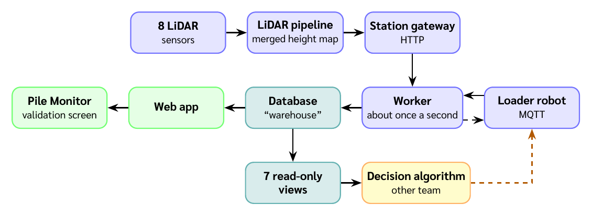

<table>
  <tr>
    <td width="50%" align="center" valign="top"></td>
    <td width="50%" align="center" valign="top">
      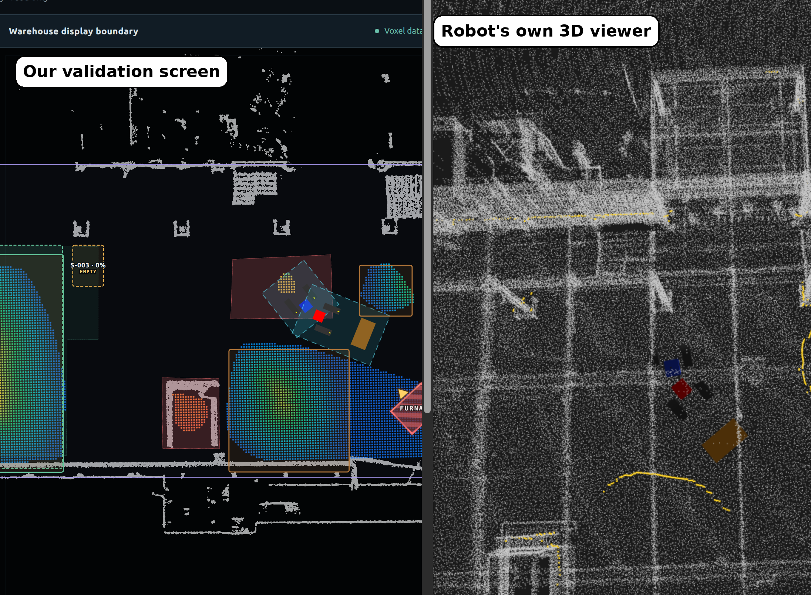
       Field test on 26 September 2026, before correction: the robot marker on our validation screen appeared too far ahead compared with the robot’s own viewer. The position was corrected the same day.
    </td>
  </tr>
</table>

#### FACOBOT AMR — Operator Interface & ROS 2 Integration

*Dec 2025 — May 2026*

Worked on the operator interface and robot integration for a warehouse AMR.

- Integrated operator controls and workflows with ROS 2 actions and robot state.
- Implemented interface workflows for manual control and missions, and contributed software safety behavior.
- Helped debug and integrate navigation-related features; core navigation, QR, Pure Pursuit, and docking algorithms were primarily developed by other team members.

  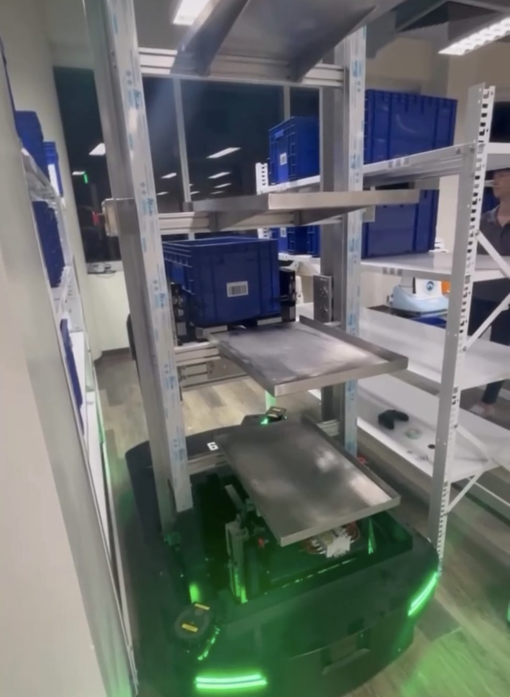
  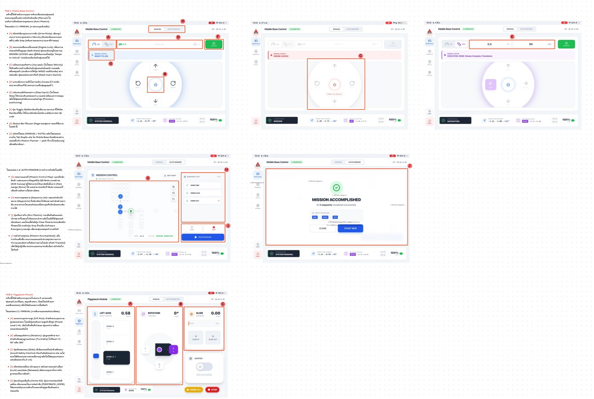

#### Carver — ROS 2 Migration & SLAM / Localization

*Jun 2026 — Jul 2026*

Contributed the SLAM/localization subsystem to a team project migrating a conventional PLC-based system toward ROS 2.

- Generated maps, tuned localization, and integrated LiDAR, TF, odometry, and ROS 2 topics.
- Integrated the subsystem with the team's simulation; the project was completed at simulation level.

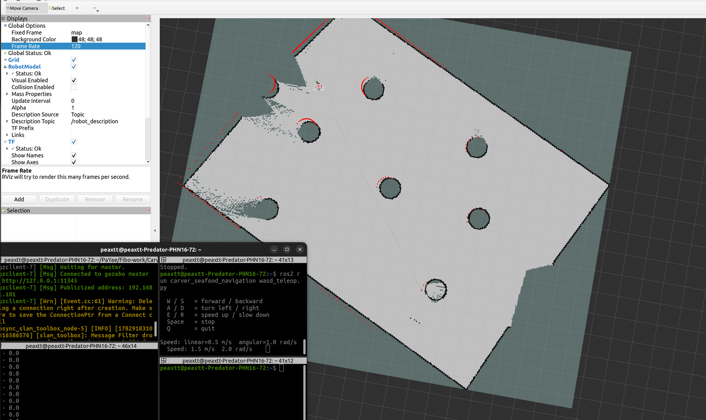

---

### Additional Technical Work

#### Peplink — GPS–Odometry Alignment

*Jan 2026 — Mar 2026*

Owned the GPS-to-robot-odometry alignment task and tested it with real hardware and data.

- Worked on coordinate conversion, frame alignment, covariance handling, and integration of the alignment logic.

---

### Coursework & Robotics Projects

#### FRA161 — Squash Ball Hitting Machine

- Designed logic-control electronics using 555 timer and relay circuits; worked on the PCB, power supply, and joystick control.
- Soldered, wired, tuned, and tested the physical machine.

  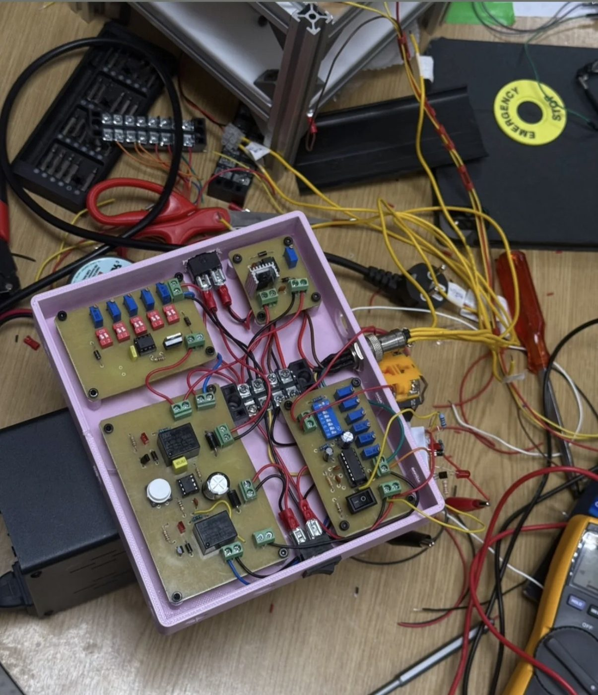
  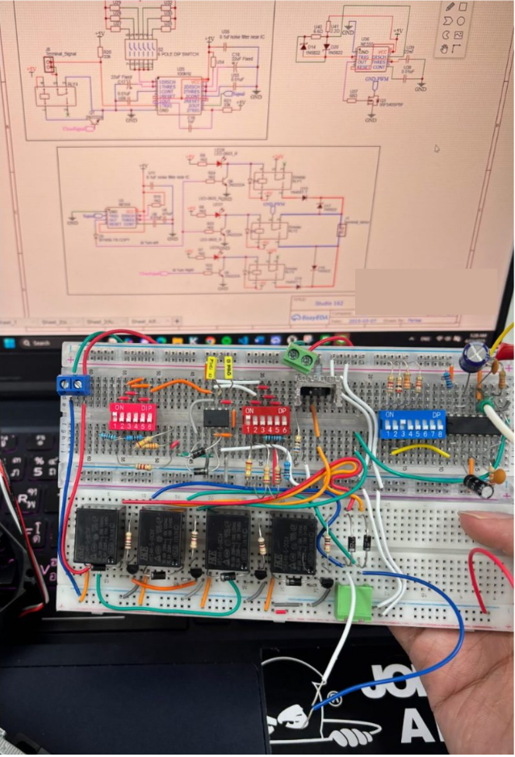
  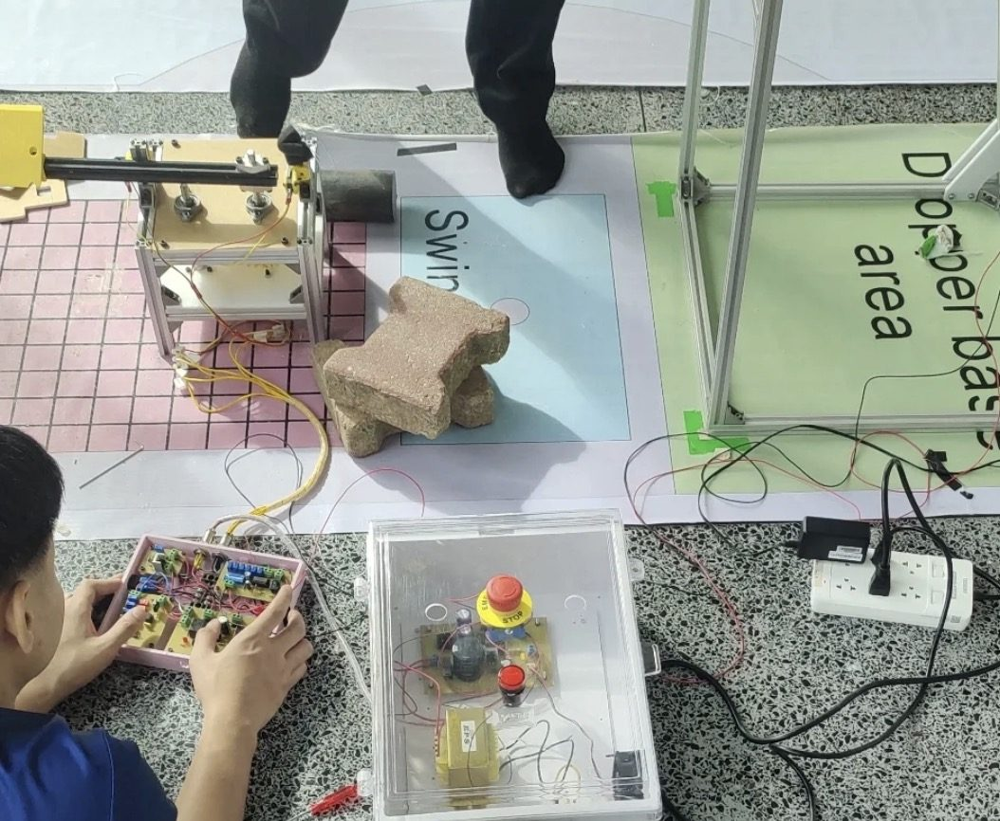

#### LiftEase — Patient Transfer Bed

Team project. Contributed to the mechanical structure, conveyor and motor selection, electrical controls, firmware, and directional control interface; participated in prototype assembly and testing.

  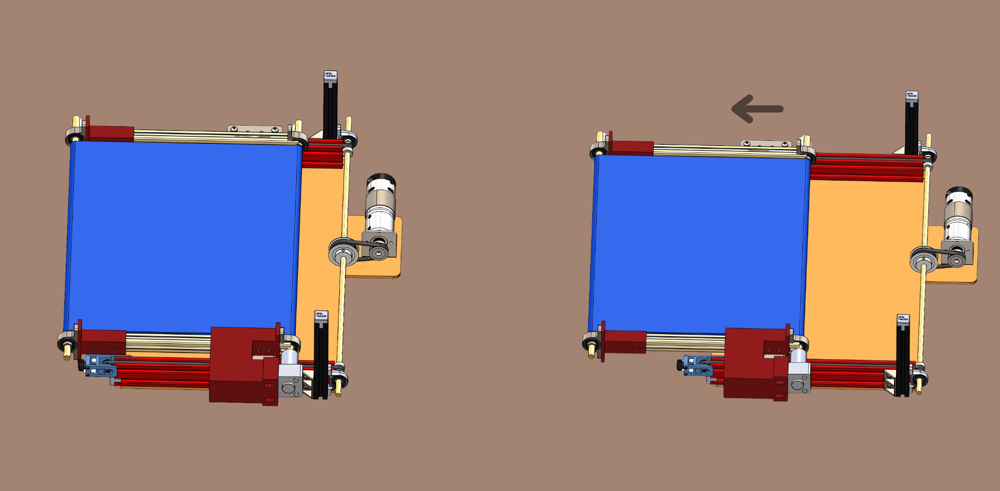
  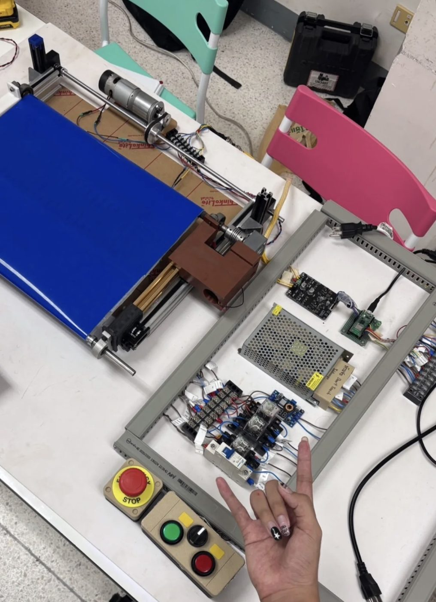

#### 1-DOF Pick-and-Place Arm

Designed the electrical/control system, selected components, and wired the control box. Worked on STM32 firmware, safety circuits, and sensors; tested the system on hardware. My contribution was electrical and control, not the mechanical arm structure.

  
  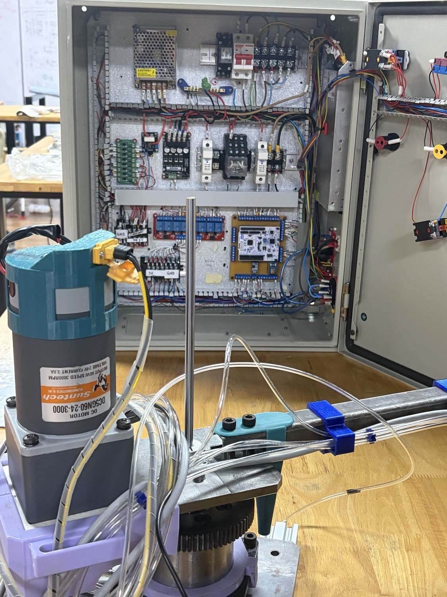
  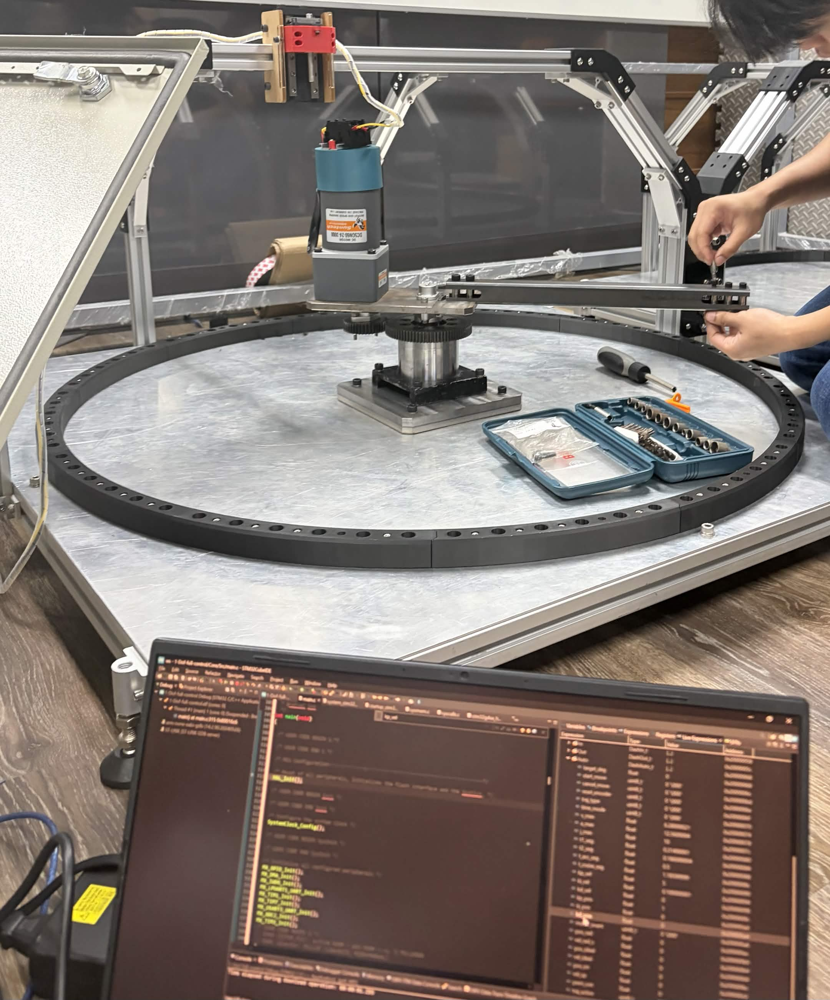

#### Grease Separator / Oil Skimmer

Worked on control electronics and firmware, pH sensor integration, and display/indicator integration; tested the physical prototype.

  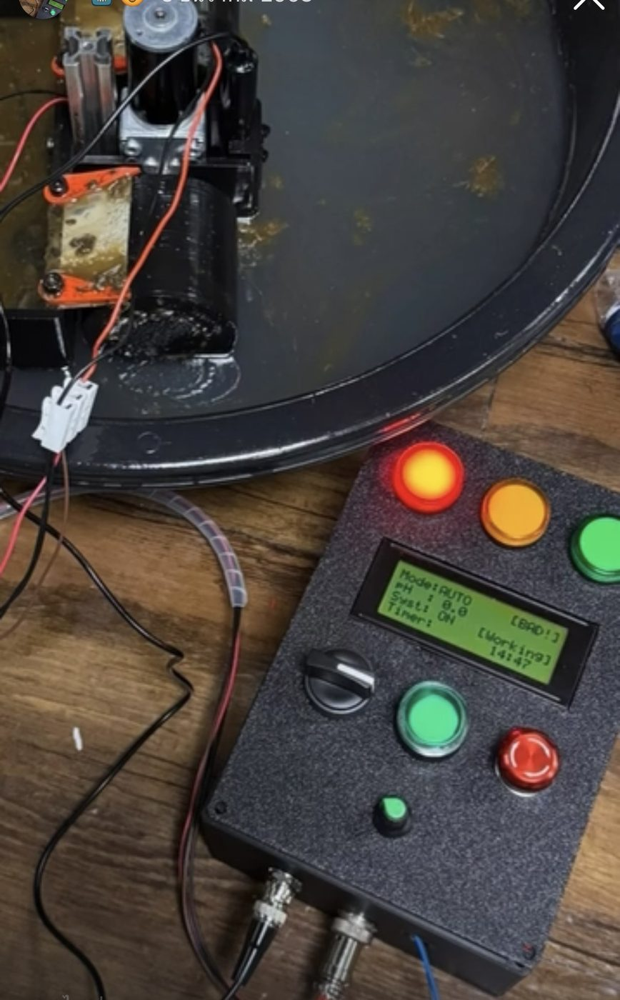
  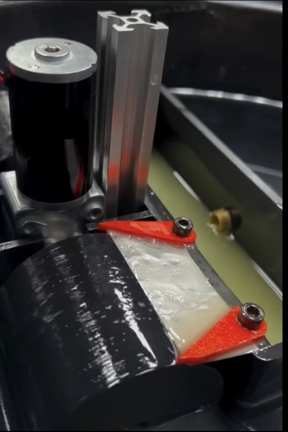

#### ABU Robocon — Meihua

Contributed to mobile-base software using ROS 2 and micro-ROS, integrated team members' software, and supported troubleshooting, testing, and tuning on the real robot.

  
  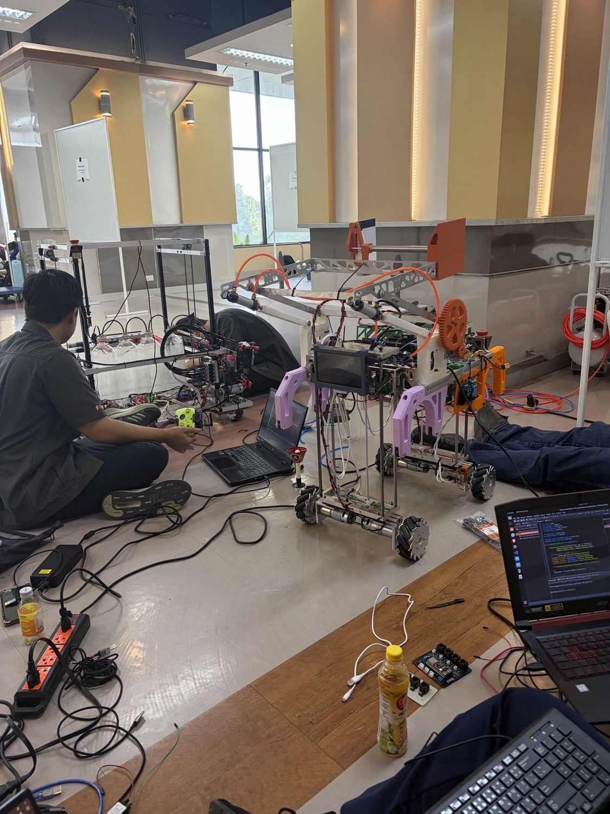

---

### Technologies & Tools I’ve Worked With

Practical exposure across projects; not a proficiency ranking.

| Area | Technologies & Tools |
|---|---|
| **Robotics & Integration** |  `micro-ROS` `TF2` `Nav2` `SLAM / Localization` `LiDAR Integration` |
| **Backend & Data** |    `Supabase` `MQTT` `WebSocket` `REST API` |
| **Embedded & Control** |    `555 / Relay Logic` `Sensors` `PLC Integration & Testing` |
| **Interfaces & Field Tools** |    `Windows` `PowerShell` |

---

### Contact

  
  

<!-- TODO: Add Resume PDF and LinkedIn links when available. -->
